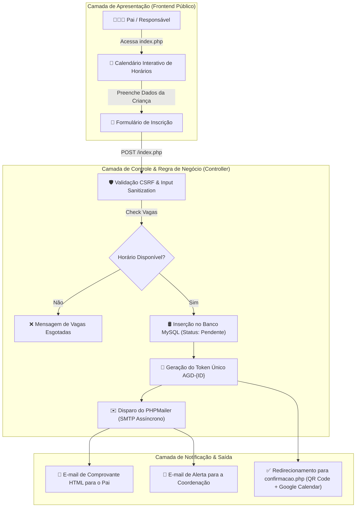
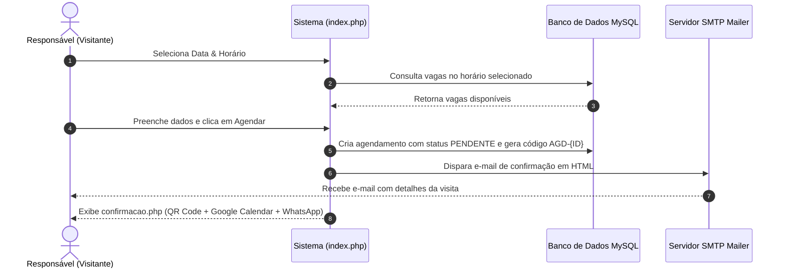
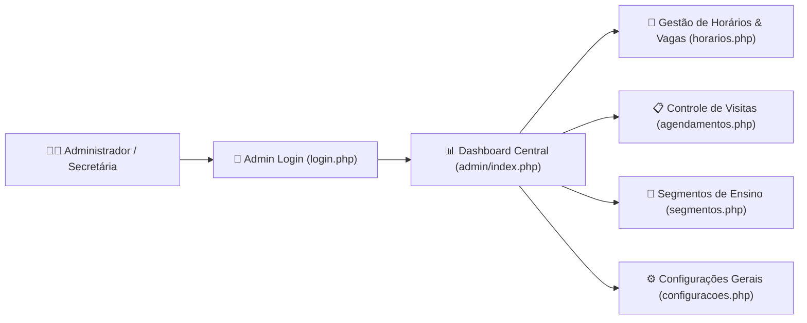

<div align="center">
  <h1>📅 Agenda Escolar PHP (MVC Architecture)</h1>
  <p><b>Plataforma Completa de Gestão de Agendamento Acadêmico, Visitas Guiadas, Atendimento a Pais e Notificações Automatizadas</b></p>

  <p align="center">
    
    
    
    
    
  </p>
</div>

---

> [!WARNING]
> **PROPRIEDADE INTELECTUAL E LICENCIAMENTO COMERCIAL**
> 
> A **Agenda Escolar PHP** é um sistema proprietário com licença de uso condicional desenvolvido por **Eduardo Junior Alcântara da Silva**.
> - 🎓 **Uso Pessoal & Didático:** Gratuito mediante **atribuição obrigatória** de créditos ao autor original (Eduardo Junior Alcântara da Silva + link para este repositório).
> - 💼 **Uso Comercial & Venda:** **Estritamente proibido** utilizar em instituições de ensino privadas ou revender sem licença comercial autorizada por escrito. Leia o arquivo [`LICENSE.md`](file:///LICENSE.md).

---

## 📌 Sobre o Projeto

A **Agenda Escolar PHP** foi desenvolvida para resolver uma dor crítica na gestão de instituições de ensino: o **processo de recepção e agendamento de visitas de pais e responsáveis de novos alunos**. 

Em vez de depender de trocas manuais de mensagens no WhatsApp ou planilhas desorganizadas, a plataforma oferece uma experiência moderna, auditável e 100% automatizada tanto para os visitantes quanto para a coordenação pedagógica e equipe de secretaria.

O sistema gera automaticamente códigos de acompanhamento únicos (`AGD-{ID}`), confirmações com QR Code, botões para inclusão direta no Google Agenda do celular do pai, e envia e-mails em HTML via SMTP.

---

## 🏗️ Arquitetura do Sistema e Engenharia de Software

O projeto adota a arquitetura **Model-View-Controller (MVC)** em PHP Puro (Vanilla PHP), garantindo extrema velocidade, facilidade de manutenção e zero sobrecarga de frameworks externos. Pode rodar em qualquer hospedagem compartilhada simples (cPanel, Hostinger, Replit, VPS).



---

## 👥 Fluxos Detalhados: Usuário Público vs. Administrador

### 🌐 1. Fluxo do Visitante (Público)
1. **Seleção de Data e Horário:** O visitante escolhe o dia desejado em um calendário visual dinâmico.
2. **Filtro de Segmento:** Seleciona o nível de ensino de interesse da criança (ex: Educação Infantil, Ensino Fundamental I, Ensino Médio).
3. **Formulário de Inscrição:** Informa nome do responsável, e-mail, telefone/WhatsApp, nome e idade da criança.
4. **Comprovante Instantâneo:** Ao finalizar, o visitante é direcionado para a página de confirmação (`confirmacao.php`), onde pode:
   - Visualizar o **Código Único de Acompanhamento** (`AGD-15`, `AGD-42`, etc.).
   - Escanear o **QR Code** de validação na portaria da escola.
   - Clicar no botão **Adicionar ao Google Agenda** para criar o lembrete no celular.
   - Enviar mensagem de confirmação para o WhatsApp da escola com 1 clique.
   - Imprimir o comprovante de visita em PDF/Papel.



---

### 🔐 2. Fluxo do Administrador / Coordenação (`/admin`)
1. **Autenticação Segura:** Login administrativo com senha criptografada via `password_hash()` BCRYPT.
2. **Dashboard de Métricas (`admin/index.php`):** Painel gráfico com total de visitas pendentes, confirmadas, canceladas e relatório por segmento.
3. **Gestão de Horários e Vagas (`admin/horarios.php`):** O administrador pode abrir novos dias de visita, definir limite de vagas por horário e bloquear datas festivas ou feriados.
4. **Gestão de Segmentos (`admin/segmentos.php`):** Cadastro e edição dos níveis de ensino oferecidos pela escola.
5. **Controle de Agendamentos (`admin/agendamentos.php`):** Alteração de status (Pendente ➡️ Confirmado ➡️ Realizado ➡️ Cancelado), busca por código AGD ou nome do pai, e exportação de relatórios.
6. **Central de Ajuda Integrada (`admin/ajuda.php`):** Documentação interna completa e base de conhecimento (`knowledge-base.json`) para treinamento de novas secretárias.



---

## 📂 Estrutura de Arquivos do Projeto

```
agenda-escolar-php/
├── admin/                        # Painel Administrativo Autenticado
│   ├── api/                      # Endpoints REST internos (status, horários, chat)
│   ├── data/                     # Base de conhecimento em JSON (knowledge-base.json)
│   ├── includes/                 # Componentes reutilizáveis (header, footer, nav)
│   ├── administradores.php       # Gestão de usuários do painel
│   ├── agendamento-detalhes.php   # Prontuário completo de uma visita
│   ├── agendamentos.php          # Tabela de controle de agendamentos
│   ├── ajuda.php                 # Central de ajuda interna
│   ├── calendario.php            # Visão de calendário administrativo
│   ├── configuracoes.php         # Configurações do sistema
│   ├── horarios.php              # Abertura de vagas e horários
│   ├── index.php                 # Dashboard principal
│   ├── login.php                 # Tela de login
│   ├── logout.php                # Destruição de sessão segura
│   └── segmentos.php             # Gestão de níveis de ensino
├── assets/                       # Recursos estáticos
│   ├── css/                      # Folhas de estilo (UI limpa e responsiva)
│   └── js/                       # Scripts JS (App principal, validações)
├── includes/                     # Bibliotecas do Core
│   ├── phpmailer/                # Biblioteca nativa PHPMailer (SMTP)
│   ├── auth.php                  # Guardas de autenticação e sessão
│   ├── db.php                    # Conexão PDO segura com MySQL
│   ├── footer.php                # Rodapé público
│   ├── functions.php             # Helpers, sanitizadores CSRF e utilitários
│   └── header.php                # Cabeçalho público com identidade genérica
├── .htaccess                     # Regras de segurança Apache (bloqueio de .env e includes)
├── agendar.php                   # Controller de redirecionamento
├── config.php                    # Arquivo de configuração geral e constantes
├── confirmacao.php               # Tela de comprovante pós-agendamento
├── db.php                        # Wrapper de conexão auxiliar
├── index.php                     # Formulário público de agendamento
├── install.php                   # Script de instalação e criação de tabelas
├── LICENSE.md                    # Termos de licença acadêmica e comercial
├── limpeza.php                   # Utilitário de faxina de dados de teste
├── logo_escola_gen.png           # Logotipo genérico do sistema
└── README.md                     # Esta documentação completa
```

---

## 🛡️ Camadas de Segurança Implementadas

- **Proteção CSRF:** Todos os formulários possuem tokens CSRF únicos (`gerarCSRFToken()`) validados antes de qualquer persistência.
- **SQL Injection Prevention:** 100% das consultas ao banco de dados utilizam **PDO Prepared Statements** com binding estrito de parâmetros.
- **XSS Escaping:** Todas as saídas de dados no HTML utilizam `htmlspecialchars()` para impedir injeções de scripts maliciosos.
- **Criptografia de Senhas:** Senhas administrativas armazenadas com `password_hash()` BCRYPT.
- **Segurança de Sessão:** Cookies de sessão configurados com flags `HttpOnly` e `SameSite` ativas.

---

## 🚀 Como Instalar e Rodar na sua Máquina

### 1. Requisitos
- PHP 8.0 ou superior.
- Banco de Dados MySQL / MariaDB.
- Servidor Web (Apache com `mod_rewrite` habilitado ou Nginx).

### 2. Passo a Passo de Instalação

1. **Baixar o código:**
   ```bash
   git clone https://github.com/Eduardo00073/agenda-escolar-php.git
   ```

2. **Configurar o Banco de Dados:**
   - Crie um banco de dados MySQL vazio (exemplo: `agenda_escolar`).
   - Edite o arquivo `config.php`:
     ```php
     define('DB_HOST', 'localhost');
     define('DB_NAME', 'agenda_escolar');
     define('DB_USER', 'seu_usuario');
     define('DB_PASS', 'sua_senha');
     ```

3. **Executar a Instalação Automática:**
   - Abra o navegador e acesse: `http://localhost/agenda-escolar-php/install.php`
   - O script criará a estrutura completa das tabelas (`agendamentos`, `horarios_disponiveis`, `segmentos`, `administradores`) e cadastrará o login padrão:
     - **Usuário:** `admin@escolaexemplo.com.br`
     - **Senha:** `admin123`

4. **Configurar Envio de E-mails (SMTP):**
   - No `config.php`, informe os dados do seu servidor de e-mail:
     ```php
     define('SMTP_HOST', 'smtp.seuprovedor.com.br');
     define('SMTP_PORT', 465);
     define('SMTP_USER', 'contato@escolaexemplo.com.br');
     define('SMTP_PASS', 'sua_senha_smtp');
     ```

---

## 📄 Termos de Licença Detalhados

Este projeto utiliza uma **Licença Acadêmica com Restrição Comercial**:
- **Uso Gratuito:** Permitido para estudantes, professores, pesquisadores e entusiastas, **desde que mantidos os créditos originais ao desenvolvedor** (Eduardo Junior Alcântara da Silva + link para este repositório).
- **Uso Comercial:** É proibido como produto pago, serviço SaaS ou em escolas privadas com fins lucrativos sem licenciamento contratual prévio.

Para negociar uma licença comercial ou suporte técnico:
- 🌐 **Website:** [www.prof-eduardo.com](https://www.prof-eduardo.com/)
- 💼 **LinkedIn:** [linkedin.com/in/edu7](https://www.linkedin.com/in/edu7/)

---

<div align="center">
  <p>© 2026 Eduardo Junior Alcântara da Silva. Todos os direitos reservados.</p>
</div>
