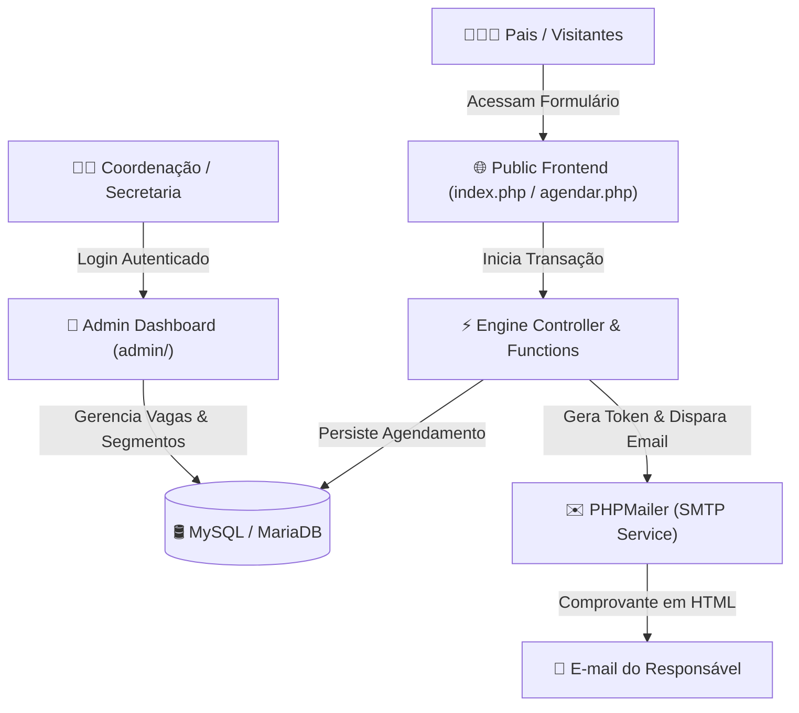

<div align="center">
  <h1>📅 Agenda Escolar PHP (MVC & PHP-Mailer)</h1>
  <p><b>Sistema Web Completo para Gestão de Agendamento de Visitas Acadêmicas e Atendimento a Pais</b></p>

  <p align="center">
    
    
    
    
  </p>
</div>

---

> [!WARNING]
> **PROPRIEDADE INTELECTUAL & LICENCIAMENTO COMERCIAL**
> 
> A **Agenda Escolar PHP** é um sistema proprietário com licença de uso condicional desenvolvido por **Eduardo Junior Alcântara da Silva**.
> - 🎓 **Uso Pessoal & Didático:** Gratuito mediante **atribuição obrigatória** de créditos ao autor original.
> - 💼 **Uso Comercial & Venda:** **Estritamente proibido** utilizar em instituições de ensino pagas ou revender sem licença comercial autorizada por escrito. Leia o arquivo [`LICENSE.md`](file:///LICENSE.md).

---

## 📌 Visão Geral

Desenvolvido para atender às necessidades operacionais de secretarias e coordenações pedagógicas, a **Agenda Escolar PHP** é uma solução completa para organizar a recepção de novos alunos e visitas de pais a escolas e colégios.

O sistema elimina o caos de planilhas e mensagens manuais, permitindo que os responsáveis escolham o melhor dia e horário para conhecer a estrutura física e pedagógica da instituição, recebendo confirmações instantâneas por e-mail.

---

## 🏗️ Arquitetura do Sistema

O projeto adota uma arquitetura em **PHP Puro (Vanilla MVC)**, dispensando dependências de frameworks pesados e garantindo execução ultrarrápida em qualquer hospedagem compartilhada (cPanel, Hostinger, Replit, etc.).



---

## 🌟 Principais Recursos

### 1. 📅 Agendamento Público e Inteligente
- Visualização em **Calendário Dinâmico** com bloqueio de datas passadas e horários lotados.
- Seleção de **Segmento de Ensino** (Educação Infantil, Ensino Fundamental I/II, Ensino Médio).
- Geração automática de **Token de Acompanhamento** para cada visita.

### 2. ✉️ Notificações e Comprovantes via E-mail
- Integração nativa com **PHPMailer (SMTP)**.
- Envio de **comprovante estilizado em HTML** com data, horário e instruções para o visitante.
- Alerta automático para a equipe de recepção da escola a cada nova inscrição.

### 3. 🔐 Painel Administrativo Completo (`/admin`)
- **Dashboard Central:** Métrica de agendamentos por dia, semana e mês.
- **Gestão de Horários:** Configuração flexível de vagas disponíveis por dia da semana.
- **Gerenciador de Segmentos:** Cadastro dinâmico dos níveis de ensino oferecidos pela escola.
- **Controle de Acesso:** Cadastro de administradores e secretárias com senhas criptografadas (`password_hash`).

---

## 🛠️ Como Instalar e Rodar Localmente

### Pré-requisitos
- Servidor Web (Apache/Nginx) com **PHP 8.0+**
- Banco de Dados **MySQL / MariaDB**
- Extensões PHP ativas: `pdo_mysql`, `openssl`, `curl`

### Passo a Passo

1. **Clonar o Repositório:**
   ```bash
   git clone https://github.com/Eduardo00073/agenda-escolar-php.git
   cd agenda-escolar-php
   ```

2. **Configurar o Banco de Dados:**
   - Crie um banco de dados limpo no MySQL (ex: `agenda_escolar`).
   - Edite o arquivo `config.php` informando as credenciais:
     ```php
     define('DB_HOST', 'localhost');
     define('DB_NAME', 'seu_banco_de_dados');
     define('DB_USER', 'seu_usuario');
     define('DB_PASS', 'sua_senha');
     ```

3. **Executar a Instalação Automática:**
   - Acesse no navegador: `http://localhost/agenda-escolar-php/install.php`
   - O script criará todas as tabelas e inserirá o usuário administrador padrão (`admin@escolaexemplo.com.br` / `admin123`).
   - **IMPORTANTE:** Apague ou renomeie o arquivo `install.php` após a instalação por motivos de segurança.

4. **Configurar o E-mail (SMTP):**
   - No `config.php`, configure suas credenciais de e-mail para envio das notificações:
     ```php
     define('SMTP_HOST', 'smtp.seuprovedor.com.br');
     define('SMTP_PORT', 465);
     define('SMTP_USER', 'contato@suaescola.com.br');
     define('SMTP_PASS', 'sua_senha_smtp');
     ```

---

## 💼 Licenciamento e Contato Comercial

Para solicitar adequação visual (White-label), customização de código ou licença de uso comercial:

- **Desenvolvedor:** Eduardo Junior Alcântara da Silva
- 💼 **LinkedIn:** [linkedin.com/in/edu7](https://www.linkedin.com/in/edu7/)
- 🌐 **Website:** [www.prof-eduardo.com](https://www.prof-eduardo.com/)

---

<div align="center">
  <p>© 2026 Eduardo Junior Alcântara da Silva. Todos os direitos reservados.</p>
</div>
